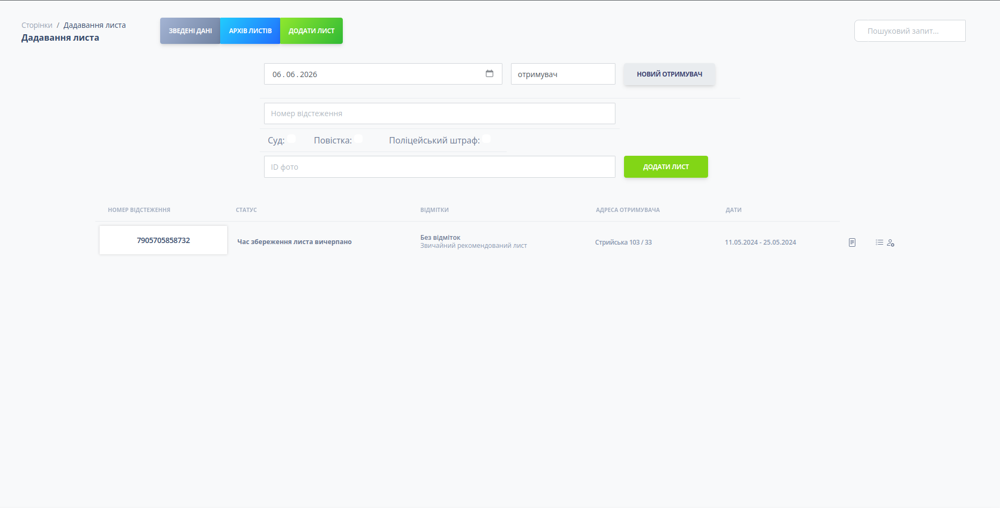

# Postman Services

The project is trying to create an extended edition or the next iteration of "[The Postman CRM](https://github.com/ychernyshev/the_postman_crm__example)" project. This idea includes a new visual, clear view, and soft design, and adds new futures to controlling of post flow, like generating and printing accompanying documentation and analytics. This project includes an empty Vue.js template for future transfer to a frontend framework for use with reactivity, with Django as the project backend.

## Project opportunities
- Creating entries: packages and recipients
- Show list of entries with pagination
- Searching per packages
- Mark packages per categories
- Generating and printing accompanying documentation
- Analytics
- Package storage time control, current status, and notification
- Including the package image

## Project setup
### Django
### Add environment
```
python3 -m venv venv
```

### Activate environment
```
source venv/bin/activate 
```

### Install requirements
```
pip install -r requirements.txt
```

### Migrate models
```
python3 manage.py migrate
```

### Run server
```
python3 manage.py runserver
```

### Page address
```
http://localhost:8000
```

### Vue
### Project setup
```
yarn install
```

### Compiles and hot-reloads for development
```
yarn serve
```

### Compiles and minifies for production
```
yarn build
```

### Project preview


## 📜 License
This project is licensed under the MIT License - see the [LICENSE](LICENSE) file for details.